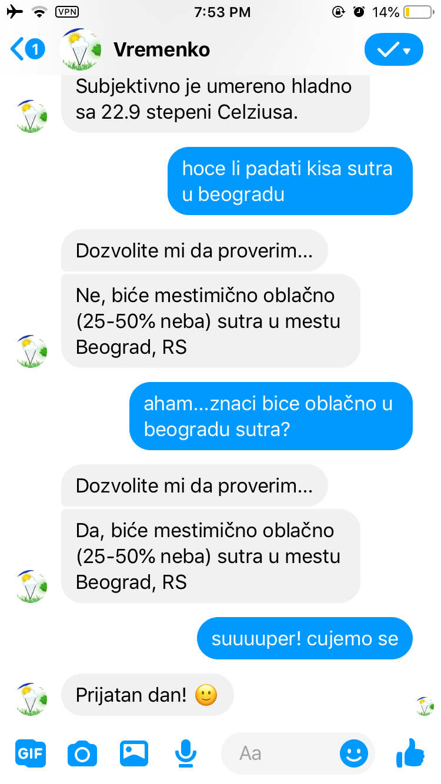

# A rule-based weather chatbot
 ## Descirption:
 A simple messenger rule-based weather bot that is implemented using NodeJs for the backend.

 ## How it works:
 The bot integrates with the a real weather API that feeds it with data about a specific city's weather, so all you have to do is to ask the bot for the weather on Serbian (latin alphabet with or without "č,ć,ž,š,đ") and you get the forecast immediatly parsed in more human like response.

 You can either ask chatbot about the weather for desired city or just ask about weather condition for tomorrow, day after tomorrow or today, or by making personal assumption about the weather condition for desired city and let the chatbot give you confirmation or not with the real weather details.

 ## Screen shots:
 
 Original conversation (Serbian):

 
 ----------------------------------------------------

 
 ----------------------------------------------------

 
 ----------------------------------------------------
 Conversation translated on English:

 

 ## Final talk:
 This project is deployed on free dyno on Heruko, so after not usage or spending my free dyno hours that I get each month, it'll go to sleep until I wake him up again. But, if that happend, you know that sleep makes human digest knowledge, so as we, he may come smarter. Greetings up until my next project!